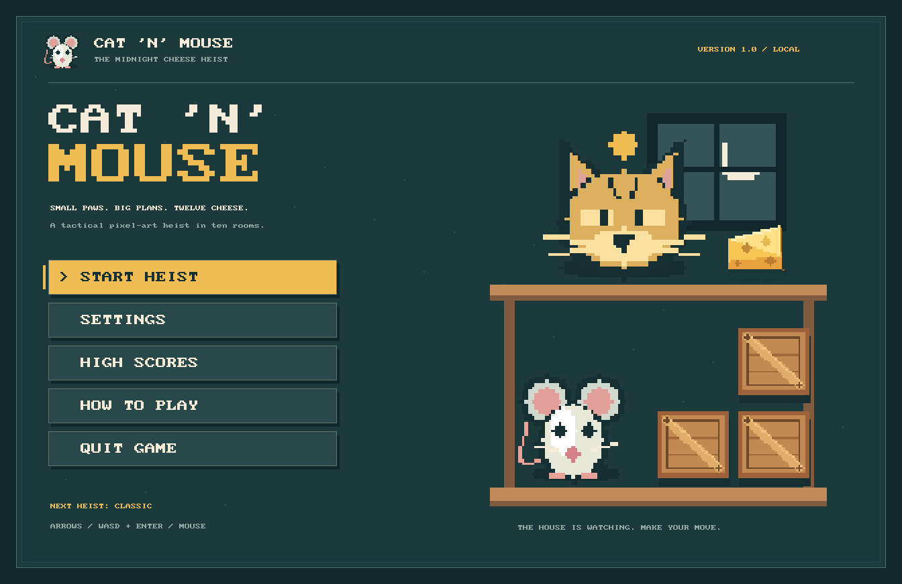

# Cat 'n' Mouse

A complete ten-room tactical cheese heist, written in Zia using Zanna's 2D
runtime. You are the mouse. Collect twelve cheese pieces in each room, keep
crates between yourself and the cats, and reach the exit. In rooms 4, 7 and 10,
you must also box in every cat.

The board is **20 × 11 cells**, including the enclosing walls, with **64 × 64
pixels per cell**. The entire 1280 × 704 board stays visible in a 1344 × 872
window, with status above and controls below.

The presentation is pixel art throughout: crisp sprites, bitmap lettering,
stepped shapes, animated pixel details and nearest-neighbor scaling. Everything
is generated in code, including the original looping chiptune and sound effects.
Optional PNGs can replace individual sprites without changing game code. No
downloads or external libraries are required.



The front menu includes Start/Resume, Settings, High Scores, How to Play and Quit.
Menus support keyboard, mouse and controller navigation. The pause menu preserves
the current heist, including when returning to the main menu.

## Play

From the Zanna checkout:

```sh
./build/src/tools/zanna/zanna run zannademos/catnmouse
```

For a native executable (recommended for play):

```sh
./build/src/tools/zanna/zanna build zannademos/catnmouse -o zannademos/bin/catnmouse
./zannademos/bin/catnmouse
```

On Windows, use `build\src\tools\zanna\zanna.exe` and an output path ending
in `.exe`. The game source has no platform-specific branches. Build the compiler
first using the repository's platform build script if it is not available.

The project deliberately lives at `zannademos/catnmouse/`, as requested. The
bulk demo builder currently accepts only `games/`, `apps/`, and `3d/` categories;
build this project directly with the command above. Its checks are registered
in `zannademos/demo_tests.tsv` and run through the usual demo test runner.

## macOS installer

The Apple silicon package (macOS 14+) is written to
`../../zannagames/Cat-n-Mouse-1.0.0-macos-arm64.dmg.zip`, alongside the DMG,
checksums and artifact manifest. Unzip, open the DMG, drag the game to
Applications, then eject the image. No Zanna installation is needed to play.

The app uses **ad-hoc signing**, matching Legacy Baseball; it is not Apple
notarized. On first launch, trusted recipients may need to approve this specific
app under System Settings → Privacy & Security → Open Anyway. The ZIP includes
an installation guide with [Apple's instructions](https://support.apple.com/102445).
Do not disable Gatekeeper globally. Managed Macs can prohibit this exception.

Rebuild the package on an Apple silicon Mac with the existing Zanna toolchain:

```sh
sh zannademos/catnmouse/packaging/package_macos.sh
# Optional: also exercise the real window/audio from the mounted app.
CATNMOUSE_PACKAGE_WINDOW_TEST=1 sh zannademos/catnmouse/packaging/package_macos.sh /tmp/catnmouse-release
```

The recipe regenerates the pixel icon and installer backdrop, builds with
warnings as errors, signs through Zanna's packager, remounts the compressed
image read-only, verifies the complete bundle signature, runs its smoke entry
from outside the checkout, tests the ZIP and produces SHA-256 checksums. It
refuses to overwrite an existing release. The current package is arm64, not
Intel/universal. A clean downloaded-install test on another Mac remains useful.

## Controls and rules

| Action | Keyboard | Controller |
| --- | --- | --- |
| Move / navigate | Arrows or WASD | D-pad or left stick |
| Wait one turn | Space | X / Square |
| Confirm / continue | Enter | A / Cross |
| Back / cancel / pause | Escape | B / Circle |
| Pause / resume | P | Start / Options |
| Help | H / F1 | Back / View |
| Toggle lane overlay | L | Y / Triangle |
| Offer surrender (costs one life) | R | Right bumper / R1 |
| Toggle music | M | Settings menu |
| Toggle sound effects | N | Settings menu |

Controller labels follow Zanna's standard logical layout. Any connected supported
controller can operate the game; hot connection is handled by the runtime. Losing
window focus or disconnecting the last controller while using it pauses play.
The analog stick engages at 0.55 and must return within 0.25 of center to rearm;
diagonals choose the dominant axis. This prevents drift and accidental repeated
turns. Menus show controller hints after controller input.

Time advances only when you move, push, or wait. There is no key-repeat movement;
release and press again for another turn. Invalid moves do not spend turns.

Cats see in all four cardinal directions, however far away you are. A wall or
crate stops a sightline. Cheese and other cats do not. Entering an exposed lane
costs a life immediately, even if that cat was about to move away. Cats have no
separate contact-damage rule, but their tiles are occupied and cannot be entered.

Amber sentries never move and cannot be defeated. On Classic difficulty, blue
stalkers move every two turns; violet prowlers move every turn. Pips beneath cats show how many
turns remain until they move. They pursue you through empty neighboring tiles
and cannot push crates. A gold corner badge means a cat is standing on cheese.

To defeat a mobile cat, close its four neighboring squares with walls or crates,
including at least one crate. The final enclosing push removes it immediately.
You cannot push a crate onto another crate, cat, cheese, wall or exit. There is
no pulling, chain pushing, shooting or undo.

On Classic, uncollected cheese scatters to random empty tiles every 10 turns in rooms 1–3,
8 turns in rooms 4–7, and 6 turns in rooms 8–10. Collected cheese stays collected.
New locations can be exposed or temporarily cut off: keep useful cover around
the room and watch the countdown. If there is insufficient floor space, excess
cheese waits for the next scatter; the outstanding objective is never discarded.

On Classic, you have five lives for the entire campaign. Deaths preserve moved crates,
surviving cats, collected cheese and the turn counter. Enter returns you to the
safe empty square nearest the entrance. If no safe refuge remains, the run ends.
Surrender uses the same process. New rooms restore their authored layouts, but
your remaining lives carry forward. There are no saved checkpoints or room
restarts. An ending records your score; Enter opens the high-score board and
Escape returns to the main menu, where you can begin a new campaign.

## Settings and high scores

| Difficulty | Campaign lives | Stalker / prowler cadence | Cheese scatter: rooms 1–3 / 4–7 / 8–10 |
| --- | --- | --- | --- |
| Cozy | 7 | 3 / 2 turns | 14 / 12 / 10 turns |
| Classic (default) | 5 | 2 / 1 turns | 10 / 8 / 6 turns |
| Fierce | 3 | 2 / 1 turns | 8 / 6 / 4 turns |

Difficulty changes apply to the next heist; the current run keeps its original
rules. Music, sound effects, lane assistance and reduced motion change immediately.
Reduced motion removes screen fades, menu motes and event sparkles. Music ducks
in menus and becomes silent while the window is unfocused. If no audio device is
available, the game continues silently.

Set your three-letter initials in Settings. Each completed or failed campaign
is recorded once, with separate top-ten lists for each difficulty. Tied scores
keep their existing order. The score is 100 per cheese, 1,000 per cleared room,
250 per captured cat, minus 2 per turn, with a floor of zero. Victory adds 5,000
plus 500 per remaining life. Abandoning a live run does not submit a score.

Preferences and scores save atomically through `SaveData` under the `catnmouse`
key: macOS `~/Library/Application Support/Zanna/catnmouse/save.json`, Linux
`~/.local/share/zanna/catnmouse/save.json`, or Windows
`%APPDATA%\Zanna\catnmouse\save.json`. This is local persistence, not Steam Cloud.
Missing profiles use defaults; corrupt data or failed writes produce a visible
notice and preserve playable in-memory state. Scores shown by the real game start
empty; the visual probe uses explicitly isolated sample records for screenshots.

## Artwork and customization

See [assets/README.md](assets/README.md) for the ten PNG names, transparency,
dimensions and search order. Set `CATNMOUSE_ASSETS` to use a separate skin
directory. Missing or unreadable sprites use the generated defaults.

Rules live in `rules.zia`; the ten fixed room layouts, titles, enemy mixes and
scatter intervals are in `rooms.zia`. Rendering is in `view.zia`; artwork is in
`art.zia`. `session.zia` coordinates menus and campaign state; `menus.zia` draws
the front end; `profile.zia` owns preferences and scores; `controls.zia` unifies
keyboard/controller input; `sound.zia` builds audio; `main.zia` owns the native loop.

[DESIGN.md](DESIGN.md) contains the runtime assessment, implementation plan,
explicit decisions for the gaps in the original brief, turn-resolution order,
and acceptance scenarios.

## Reproducibility and checks

```sh
# Fixed initial RNG seed (0 through 2147483646).
./build/src/tools/zanna/zanna run zannademos/catnmouse -- --seed 173

# No window or audio device needed for these commands.
./build/src/tools/zanna/zanna run zannademos/catnmouse -- --smoke
./build/src/tools/zanna/zanna run zannademos/catnmouse -- --seed 173 --screenshot /tmp/catnmouse.png
./build/src/tools/zanna/zanna run zannademos/catnmouse -- --screenshot /tmp/catnmouse-menu.png --screen menu
./build/src/tools/zanna/zanna run zannademos/catnmouse/rules_probe.zia
./build/src/tools/zanna/zanna run zannademos/catnmouse/campaign_probe.zia
./build/src/tools/zanna/zanna run zannademos/catnmouse/visual_probe.zia
./build/src/tools/zanna/zanna run zannademos/catnmouse/session_probe.zia
./build/src/tools/zanna/zanna run zannademos/catnmouse/controls_probe.zia
./zannademos/scripts/run_demo_tests.sh --demo catnmouse --fast
```

Native executables accept the same flags without the extra `--`. A new campaign
after an ending increments the previous campaign's seed. The smoke entry also
accepts `--zanna-package-smoke`.

`--screen board|menu|settings|scores` selects a headless screenshot (requires
`--screenshot`). `--window-smoke` opens a real window, exercises 120 frames of
menu/settings/play transitions and audio setup, then closes. It never loads or
writes the player's profile.

Set `CATNMOUSE_PREVIEW` to an existing output directory when running
`visual_probe.zia` to export all rooms, title, help, dialogs, map and endings.
For `skin_probe.zia`, set `CATNMOUSE_ASSETS` to a new empty scratch directory;
the probe creates one tiny PNG and one deliberately corrupt fixture there,
verifies resize/alpha/fallback, and leaves those fixtures for inspection.

For `profile_probe.zia`, set `CATNMOUSE_PROFILE_TEST_KEY` to a new key starting
with `catnmouse-test-`. The probe refuses an existing save, verifies atomic
preferences/score round trips and corrupt-data recovery, and leaves its isolated
fixture in the platform's application-data directory. It needs write access there.

The checks cover sightline occlusion, legal/illegal pushes, capture, cat cadence,
death timing, persistent room state, respawn failure, relocation, deterministic
randomness, room boundaries, objectives, progression, pixel alpha, and all
rendered screens, menu transitions, locked difficulty, score ordering, exactly-once
recording, controller bindings, analog hysteresis, and persistent settings.

## Verified and release testing

Verified on macOS: native build with `-Wall -Werror`, native window/audio smoke,
all six registered demo checks, PNG replacement/alpha/fallback, profile persistence
and corruption recovery, and matching VM/native campaign trace `1968053772`.
The repository's 2,024-test run completed; its twelve sandbox-related failures
passed when rerun with the required filesystem/network/window access. Runtime
surface audit, platform policy lint and cross-platform smoke scripts also passed.

The macOS DMG passed read-only remount verification, strict bundle-signature
validation, and packaged headless/window/audio smoke tests. ZIP integrity and
both published SHA-256 checksums passed. The package recipe's overwrite guard
was also tested. This checks integrity and operation, not Apple notarization.

Windows/Linux hardware runs, physical-controller playtesting, and full human
campaign balance testing remain release gates. Automated invariants do not prove
every stochastic position remains recoverable. The game has a complete local
front end and campaign; Steamworks, achievements, Cloud and store assets are
not implemented. The macOS packaging recipe verifies ad-hoc signature integrity,
not automatic Gatekeeper trust; Developer ID signing/notarization and Windows/Linux
installers are not included.
